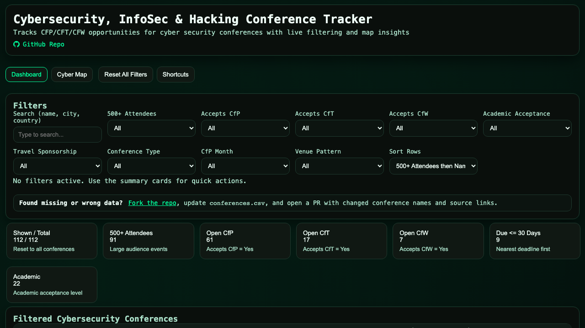

# Cybersecurity Conference Tracker

Track cybersecurity, infosec, and hacking speaking opportunities in `conferences.csv`, and view them in the static dashboard (`index.html`).

## Screenshot



## Why This Project Exists

Conference submission windows are easy to miss, and discovering relevant events often requires checking many disconnected sources. This project centralizes conference opportunities so speakers, trainers, and workshop leaders can plan submissions earlier and make travel decisions with better data.

ConferenceTracker helps you:

- Monitor upcoming conferences and avoid missing CFP/CfT/CfW deadlines
- Compare events by date, location, and format to plan a realistic speaking calendar
- Identify conferences that may provide travel or accommodation support
- Discover international opportunities for community visibility and professional growth
- Create data-backed requests for training, networking, and conference travel budgets

In short, this repository turns conference discovery from an ad-hoc process into a repeatable workflow that supports both career development and team planning.

## No backend required

This project is a **static site** (HTML, CSS, JavaScript, and `conferences.csv`). There is **no** server-side app, database, or account system to deploy. Personal UI state (filters, persona mode, pipeline, saved trips) stays in **your browser** using `localStorage` and does not get sent to a server.

You can use the **public deployment**, **self-host** a copy, or **run locally**—see [How to run (no backend)](#how-to-run-no-backend) below. Optional future features (accounts, verified badges, sync) would be additive; the core tracker is intended to remain usable as static files only.

## Updating the catalog

| Audience | Doc |
|----------|-----|
| **Catalog schema & UI** | [`docs/CATALOG.md`](docs/CATALOG.md) — columns, enums, deadlines, dashboard mapping |
| **Curators / AI agents** | [`.cursor/skills/update-conference-data/SKILL.md`](.cursor/skills/update-conference-data/SKILL.md) — research workflow (points at CATALOG) |
| **Pull requests** | [`CONTRIBUTING.md`](CONTRIBUTING.md) |

**Quick prompt for agents:** follow the skill above; return added/updated counts, touched names, remaining gaps, and sources.

## Pull Request Contribution Flow

For PR-based contribution steps (branching, commit, and PR checklist), see `CONTRIBUTING.md`.

## How to run (no backend)

The dashboard only needs **static file hosting** (or a local HTTP server). Pick one:

### 1. Use the public site

Browse and filter without cloning anything:

**[https://conference-tracker.javan.de/](https://conference-tracker.javan.de/)**

### 2. Self-host

Serve the **repository root** as static files. No runtime, build step, or database is required for the web UI.

Examples:

- **GitHub Pages:** Enable Pages on your fork; publish the branch/folder that contains `index.html` (often the repo root). Relative paths (`./app.js`, `./conferences.csv`) work as long as the site entry URL matches your folder layout.
- **Any static host or web server:** Copy the project files and point the document root at this directory.
- **Object storage + CDN:** Upload the same files; keep relative paths intact.

Forkers get their own URL (e.g. `https://<user>.github.io/<repo>/`); the app works the same.

### 3. Run locally

Browsers block loading `conferences.csv` from `file://` pages, so use a small local HTTP server. From the project root:

```bash
python3 -m http.server 8000
```

Open [http://localhost:8000/index.html](http://localhost:8000/index.html).

Other static servers are fine (for example `npx serve .` or any tool that serves the folder over HTTP).

### Backup and restore (browser data)

The UI includes **Backup & restore**: export or import a JSON file of everything this app keeps in `localStorage` (filters, favorites, private notes, persona, pipeline, saved trips, geocode cache, UI preferences, etc.). Use it to move between browsers or devices, or to snapshot before clearing site data—no account or server required.

### Speaker dashboard (static UI)

- **Table** — Sortable columns for conference dates, location, **CfP/CfT/CfW/CfV** deadlines (not yes/no pills), sponsorship, and priority; filters in the sidebar and via column headers.
- **Detail panel** — Deadlines row lists each type with date and link when present.
- **Export** — Filtered CSV export uses a speaker-focused column set (no `accepts_*`; those are derived in the app).

### Offline tools (no account)

- **Conference details** — Click a conference name to open a panel with links, persona actions, and optional **private notes** (stored locally). The URL can include `?c=…` to deep-link to a conference after you share or bookmark the link.
- **Export filtered CSV** — Download the current filtered table (plus your notes column) for spreadsheets.
- **Copy shareable link** — Copies the current URL (filters and `persona` / `view` params) for others or another device.
- **Calendar (.ics)** — From the detail panel, download an all-day event for the **next upcoming** CfP/CfT/CfW deadline (when the CSV has a valid date).

## Verifying catalog data

Use the [update-conference-data skill](.cursor/skills/update-conference-data/SKILL.md); spot-check in the app and the browser console. Run `python3 scripts/validate_catalog.py` before opening a PR.
